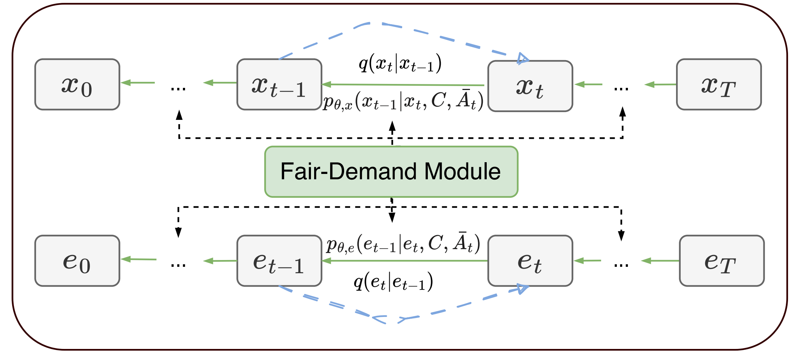

# FAP-CD: Fairness-Driven Age-Friendly Community Planning via Conditional Diffusion Generation

<p align='center'>

</p>

## 👀 Overview

Current urban development practices fall significantly short in implementing age-friendly planning, leading to elderly services that are insufficient and unevenly distributed across regions. This underscores the urgent need for age-friendly urban renewal strategies. To tackle this challenge, our work focuses on generating optimized planning schemes for urban aging facilities, tailored to the unique demands of age-friendly community planning. We introduce a novel framework called Fairness-driven Age-friendly community Planning via Conditional Diffusion generation (FAP-CD) that utilizes a conditioned graph denoising diffusion probabilistic model to learn the conditional joint probability distribution of aging facilities and their spatial relationships at a fine-grained regional level. Specifically, this approach generates optimized spatial distributions of facilities from noisy graphs, conditioned on the needs of the elderly during the denoising diffusion process.

<p align='center'>

</p>

### Environment Setup
```Shell
 conda create -n FAP python=3.8 -y
 conda activate FAP
 pip install -r requirements.txt
```


## 🎯 Usage
### 📖 Script Templates
```shell
bash run.sh 
```

## 📌 Citation

Please consider citing our paper in your publications, if our findings help your research.
```bibtex
@inproceedings{li2025fap,
  title={FAP-CD: Fairness-Driven Age-Friendly Community Planning via Conditional Diffusion Generation},
  author={Li, Jinlin and Li, Xintong and Zhou, Xiao},
  booktitle={Proceedings of the AAAI Conference on Artificial Intelligence},
  volume={39},
  number={27},
  pages={28168--28176},
  year={2025}
}
```
